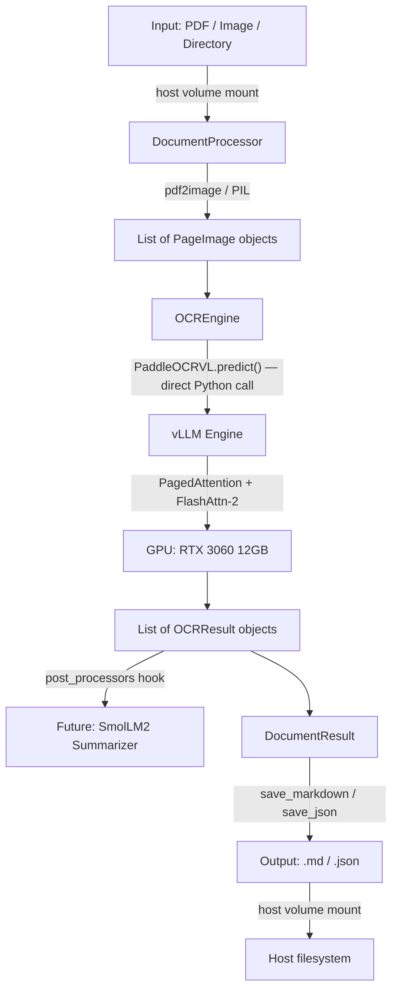
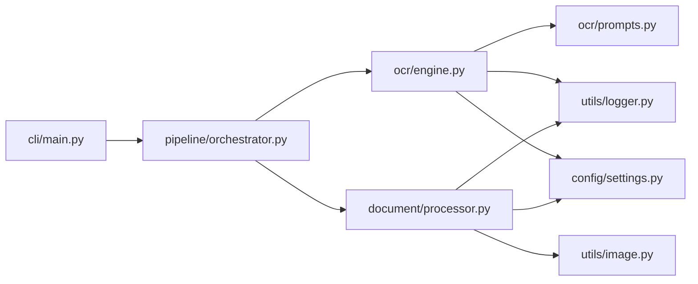

# Architecture — VLM Classification OCR Pipeline

## Overview

A **monolithic Docker** architecture for document OCR using **PaddleOCR-VL-1.5** with **vLLM** backend. Everything runs inside a single container — no HTTP API, no serialization overhead.

## Data Flow



## Key Design Decisions

| Decision | Rationale |
|---|---|
| **Monolithic Docker** | Eliminates all HTTP/serialization overhead. Direct `pipeline.predict()` calls. |
| **Lazy model loading** | CLI `--help` is instant. Model loads only on first `extract` call. |
| **Post-processor hooks** | SmolLM2 summarizer plugs in later with zero refactoring. |
| **Pydantic settings** | Single source of truth. Validated, typed, env-based config. |
| **PaddleOCR imports inside methods** | Prevents ImportError on host machine. Tests run without Docker. |

## Module Dependency Graph



## Adding SmolLM2 Summarizer (Future)

```python
# In your startup code:
from src.pipeline.orchestrator import PipelineOrchestrator

pipeline = PipelineOrchestrator()

# Define the summarizer as a post-processor
def summarize(result):
    result.summary = smolm2.generate(result.text)
    return result

# Register it — done. Zero changes to existing code.
pipeline.add_post_processor(summarize)
```
